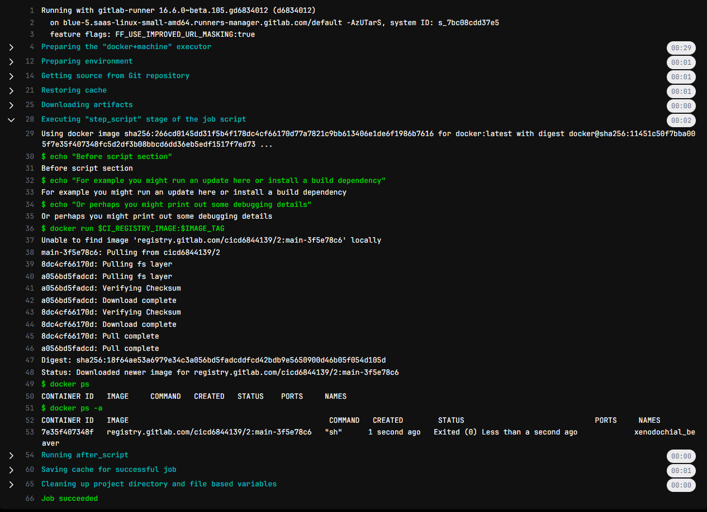

# Переписать test stage для тестирования docker-а. Достаточно проверить, что docker на базе нашего собранного образа в предыдущей job запускается.
**Решение**

```
image: busybox:latest

stages:
  - build
  - test
  - deploy

variables:
  IMAGE_TAG: $CI_COMMIT_BRANCH-$CI_COMMIT_SHORT_SHA

cache:
  key:
    files:
      - composer.lock
  paths:
    - vendor/

before_script:
  - echo "Before script section"
  - echo "For example you might run an update here or install a build dependency"
  - echo "Or perhaps you might print out some debugging details"

after_script:
  - echo "After script section"
  - echo "For example you might do some cleanup here"

build1:
  stage: build
  script:
    - mkdir -p vendor/
    - echo "build" > vendor/hello.txt
  artifacts:
    paths:
      - vendor
    expire_in: 30 days

docker build:
  image: docker:latest
  stage: build
  services:
    - docker:dind
  script:
    - docker login -u $GITLAB_CI_USER -p $GITLAB_CI_PASSWORD $CI_REGISTRY
    - echo $GITLAB_CI_USER $GITLAB_CI_PASSWORD $CI_REGISTRY $CI_REGISTRY_IMAGE:$IMAGE_TAG
    - docker build -t $CI_REGISTRY_IMAGE:$IMAGE_TAG .
    - docker push $CI_REGISTRY_IMAGE:$IMAGE_TAG

test1:
  stage: test
  script:
    - cat vendor/hello.txt

test2:
  image: docker:latest
  stage: test
  services:
    - docker:dind
  script:
    - docker run $CI_REGISTRY_IMAGE:$IMAGE_TAG
    - docker ps
    - docker ps -a

deploy1:
  stage: deploy
  script:
    - echo "Do your deploy here"
  environment: production

pages:
  stage: deploy
  script:
    - mkdir -p public
    - cp vendor/hello.txt public/index.html
    - echo 404 >> public/404.html
  artifacts:
    paths:
      - public
    exclude:
      - public/404.html
  only:
    - main
```

**Вывод**


